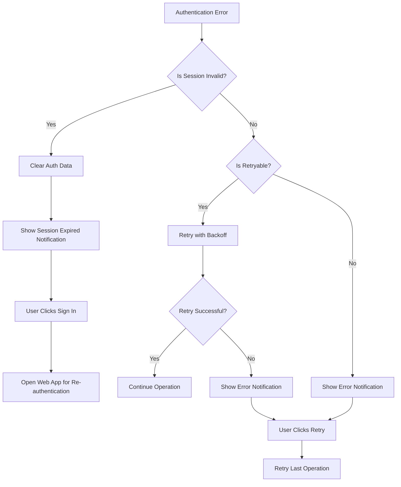

# Authentication Error Handling

This document explains how the JReader extension handles authentication errors gracefully, providing a better user experience when authentication issues occur.

## Overview

The extension now includes comprehensive authentication error handling that:

- **Detects authentication errors** automatically
- **Clears invalid sessions** to prevent repeated failures
- **Shows user-friendly notifications** with recovery actions
- **Provides retry mechanisms** for transient errors
- **Validates sessions** before attempting to use them

## Key Components

### 1. AuthErrorHandler (`src/lib/authErrorHandler.ts`)

The central error handling utility that:

- **Identifies authentication errors** from various error patterns
- **Determines if sessions are invalid** and need cleanup
- **Provides retry logic** with exponential backoff
- **Clears authentication data** when sessions are invalid
- **Maps technical errors** to user-friendly messages

#### Key Methods:

- `isAuthError(error)` - Detects if an error is authentication-related
- `isSessionInvalidError(error)` - Identifies session invalidity
- `clearAuthData()` - Removes all authentication data from storage
- `handleAuthError()` - Main error handling with recovery actions
- `retryWithBackoff()` - Retries operations with exponential backoff
- `safeAuthOperation()` - Wraps operations with error handling

### 2. AuthNotificationHandler (`src/lib/authNotificationHandler.ts`)

User notification system that:

- **Shows browser notifications** for authentication events
- **Stores notifications** for persistence across sessions
- **Provides action buttons** for recovery (e.g., "Sign In", "Retry")
- **Sends notifications to popup** when available

#### Key Methods:

- `showSessionExpiredNotification()` - Notifies user of expired session
- `showSessionRestoredNotification()` - Confirms successful restoration
- `showNetworkErrorNotification()` - Alerts about connection issues
- `showPairingRequiredNotification()` - Prompts for initial pairing

### 3. Enhanced Service Worker (`src/sw-main.ts`)

Updated service worker with:

- **Session validation** before restoration attempts
- **Graceful error handling** for all Supabase operations
- **Operation tracking** for retry capabilities
- **Automatic cleanup** on authentication failures

## Error Types Handled

### 1. Invalid Refresh Token Errors
```
AuthApiError: Invalid Refresh Token: Already Used
```

**Handling:**
- Automatically clears authentication data
- Shows "Session Expired" notification with "Sign In" action
- Prevents retry attempts (token is permanently invalid)

### 2. Missing Session Errors
```
AuthSessionMissingError: Auth session missing!
```

**Handling:**
- Clears any partial session data
- Shows "Pairing Required" notification
- Provides "Start Pairing" action button

### 3. JWT Expiration Errors
```
JWT expired
Invalid JWT
```

**Handling:**
- Validates session before use
- Clears expired sessions automatically
- Shows appropriate user notifications

### 4. Network Errors
```
Network error
Connection timeout
```

**Handling:**
- Retries with exponential backoff
- Shows "Connection Error" notification
- Provides "Retry" action button

## User Experience Improvements

### Before (Problems)
- ❌ Cryptic error messages in console
- ❌ No user notification of authentication issues
- ❌ Extension becomes unusable after auth failures
- ❌ No way to recover without manual intervention
- ❌ Repeated failed requests with invalid tokens

### After (Solutions)
- ✅ Clear, user-friendly error messages
- ✅ Browser notifications with recovery actions
- ✅ Automatic session cleanup and recovery
- ✅ One-click recovery options ("Sign In", "Retry")
- ✅ Proactive session validation prevents failures

## Implementation Details

### Session Validation

Before attempting to restore a session, the extension validates:

1. **Required fields present** (access_token, refresh_token)
2. **Non-empty tokens** (not just empty strings)
3. **Expiration time** (not expired more than 24 hours ago)
4. **Creation time** (not older than 30 days)

### Error Recovery Flow



### Notification Types

1. **Session Expired** (Warning)
   - Message: "Your authentication session has expired. Please sign in again to continue using the extension."
   - Action: "Sign In" button → Opens web app

2. **Session Restored** (Success)
   - Message: "Your authentication session has been successfully restored."
   - No action needed

3. **Connection Error** (Error)
   - Message: "Unable to connect to the server. Please check your internet connection and try again."
   - Action: "Retry" button → Retries last operation

4. **Pairing Required** (Info)
   - Message: "Please pair your extension with your account to sync cards and access your data."
   - Action: "Start Pairing" button → Initiates pairing

## Configuration

### Error Detection Patterns

The system detects these error patterns:

```typescript
const INVALID_TOKEN_ERRORS = [
  'Invalid Refresh Token: Already Used',
  'AuthApiError: Invalid Refresh Token',
  'AuthSessionMissingError',
  'JWT expired',
  'Invalid JWT',
  'refresh_token_not_found'
];
```

### Retry Configuration

- **Max retry attempts**: 3
- **Base delay**: 1000ms
- **Backoff multiplier**: 2 (exponential)
- **Max delay**: ~4 seconds

### Session Validation Rules

- **Expiration tolerance**: 24 hours (allows for clock skew)
- **Maximum age**: 30 days
- **Required fields**: access_token, refresh_token

## Testing

To test the error handling:

1. **Invalid Token Test**:
   - Manually corrupt the refresh token in storage
   - Restart extension
   - Should see "Session Expired" notification

2. **Network Error Test**:
   - Disconnect internet
   - Try to sync cards
   - Should see "Connection Error" notification with retry

3. **Session Validation Test**:
   - Set session expiration to past date
   - Restart extension
   - Should automatically clear session and show notification

## Browser Permissions

The notification system requires the `notifications` permission:

```json
{
  "permissions": ["notifications"]
}
```

## Future Enhancements

Potential improvements:

1. **Offline Mode**: Cache data when authentication fails
2. **Background Sync**: Retry operations when connection restored
3. **Error Analytics**: Track error patterns for debugging
4. **Custom Retry Logic**: Different retry strategies per operation type
5. **Session Refresh**: Automatic token refresh before expiration

## Troubleshooting

### Common Issues

1. **Notifications not showing**:
   - Check browser notification permissions
   - Verify popup is not blocked

2. **Session not clearing**:
   - Check browser storage permissions
   - Verify storage keys are correct

3. **Retry not working**:
   - Check if operation is tracked in storage
   - Verify retry handler is registered

### Debug Information

Enable debug logging by checking the console for:

- `🔍 Auth Error Details:` - Detailed error information
- `🔄 Session invalid, clearing auth data` - Session cleanup
- `✅ Session restored successfully` - Successful restoration
- `🔔 Auth notification:` - Notification events

## Conclusion

The new authentication error handling system provides a robust, user-friendly experience that gracefully handles authentication failures while providing clear recovery paths for users. This eliminates the cryptic error messages and makes the extension more reliable and user-friendly.
